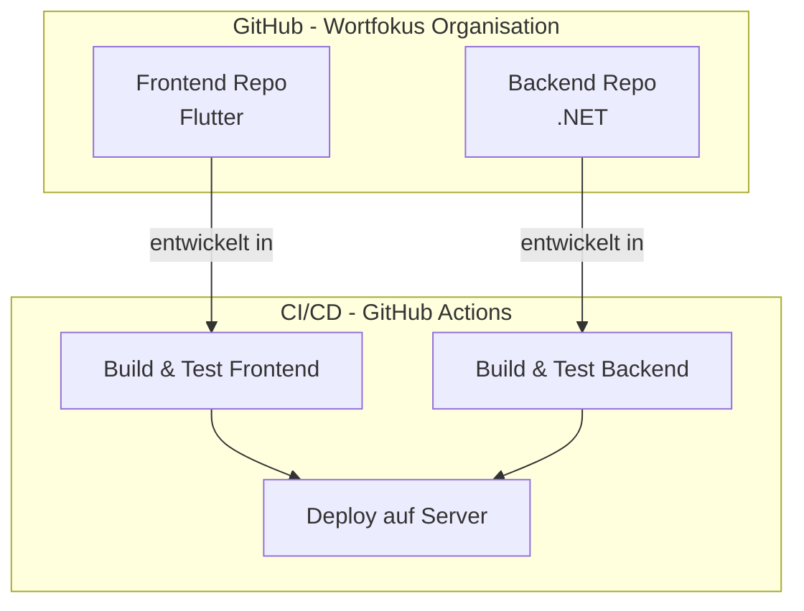

# Release Design

Since we will host our code on a provider like [Hetzner](https://www.hetzner.com/de/) and have our Code on Github, we will have the need of a workflow which is able to release our changes.

The idea is that we use the possibility of Github Actions (not yet checked) and release the code directly into our dedicated servers.

But first we have a small overview of our Github-Setup

## Github-Overview

We save our code on Github on a specific organization base.
In this organization we have repositories for our frontend and backend.

With the help of Github Actions we should be able to set up a CI/CD-Pipeline.
It will deploy our code on the server.

From there we have prepared the configuration, so that our Frontend is able to talk to the backend and our Backend with a database.
Everything is on this server, since we want some privacy.

<!--
This section describes the branching model used in the project-quiz architecture release design documentation.
It provides guidelines and structure for managing branches within the project's development workflow.
-->
## Branching-Model

Our branching model is designed to ensure code quality and smooth releases:

- **main-branch**: This is both the main and production branch. Any code merged here is automatically published, provided all checks pass and the code is correct. Only Administrators should be able to merge into this branch.
- **developer branch**: Used for testing and training. Final bug fixes and testing are performed here before release. Once approved by the administrator, code is merged into the main branch.
- **feature branches**: All issues and new features are developed in dedicated feature branches, named `feature-<number>-<title>`. After completion and testing, a pull request is made against the developer branch.
- **github-automation**: Automated checks are run before new code is added to maintain quality and correctness.

## Automation with GitHub Actions

We use GitHub Actions to automate our workflows. These actions are triggered by events such as pull requests or merges. Defined workflows handle tasks like running tests, building the project, and deploying code to our servers. This ensures that every change is validated and released efficiently, reducing manual effort and minimizing errors.