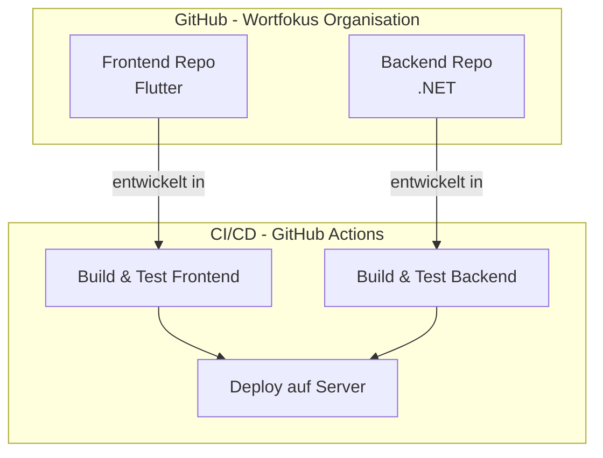

# Release Design

Since we will host our code on a provider like [Hetzner](https://www.hetzner.com/de/) and have our Code on Github, we will have the need of a workflow which is able to release our changes.

The idea is that we use the possibility of Github Actions (not yet checked) and release the code directly into our dedicated servers.

But first we have a small overview of our Github-Setup

## Github-Overview

We save our code on Github on a specific organization base.
In this organization we have repositories for our frontend and backend.

With the help of Github Actions we should be able to set up a CI/CD-Pipeline.
It will deploy our code on the server.

From there we have prepared the configuration, so that our Frontend is able to talk to the backend and our Backend with a database.
Everything is on this server, since we want some privacy.

    <!-- subgraph Server[Projekt-Server / Hosting]
        FEApp[Quiz-App Flutter Web/Mobile]
        API[Backend API .NET]
        DB[(Postgres SQL DB)]
    end

    subgraph Auth[SSO / Firebase]
        WP[Firebase SSO]
    <!-- end -->

    Deploy --> FEApp
    Deploy --> API
    API --> DB

    FEApp -->|API Calls| API
    FEApp -->|Auth| WP
    API -->|Auth Check| WP -->